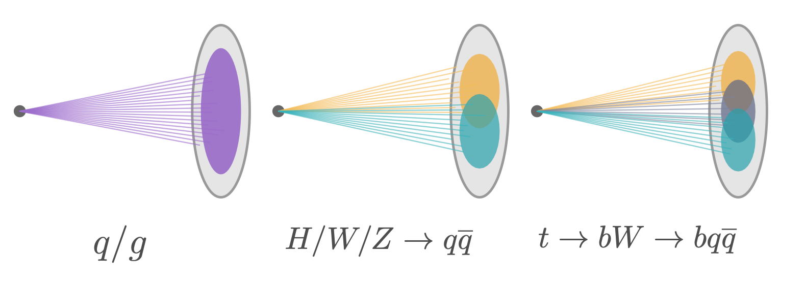
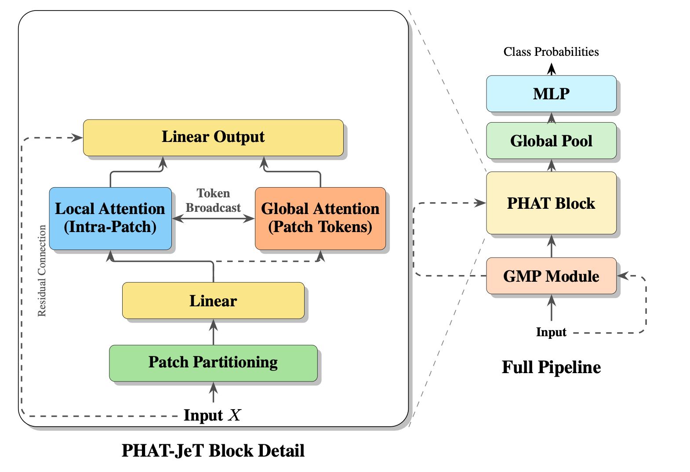
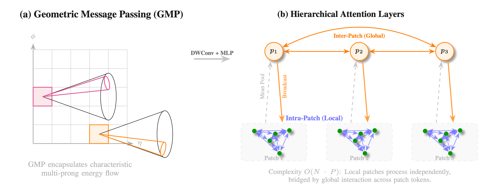

# PHAT-JeT: Patch Hierarchical Attention Transformer for Jet Tagging
Official implementation of **PHAT-JeT** (Patch Hierarchical Attention Transformer for Jet Tagging), an efficient attention-based architecture for real-time particle jet classification in high-energy physics experiments.

## Overview

PHAT-JeT addresses the challenge of performing accurate jet tagging under the extreme latency and resource constraints imposed by real-time trigger systems at the Large Hadron Collider (LHC). While transformer models achieve state-of-the-art accuracy in particle-level jet classification, their quadratic computational cost hinders deployment in real-time applications where decisions must be made within ~10 microseconds.

<p align="center">
  
</p>

*Particle jets in the detector coordinate system (η, φ). Each jet consists of collimated particle showers that must be efficiently classified in real-time.*

### Key Features

- **Geometric Message Passing (GMP)**: Physics-inspired module that encodes local detector-plane structure using lightweight 2D convolutions on a coarse grid to capture energy flow patterns
- **Hierarchical Patch-Based Attention**: Replaces global self-attention with efficient patch-wise attention that computes exact attention within small particle groups while preserving global context through lightweight patch-token communication
- **Near-Linear Scalability**: Tunable patch size enables near-linear scaling with the number of particles while maintaining expressive capacity
- **State-of-the-Art Performance**: Achieves superior accuracy and background rejection compared to existing efficient models at comparable computational budgets

## Architecture

<p align="center">
  
</p>

The PHAT block partitions input particles into patches before computing attention, enabling efficient processing while maintaining global context through patch-token interactions.

## Results

### HLS4ML LHC Jet Dataset

Performance comparison on 5-class jet classification (q, g, W, Z, t):

| Model | Accuracy (%) | ROC AUC | Avg Bkg Rej | # Params | FLOPs |
|-------|-------------|---------|-------------|----------|-------|
| **PHAT-JeT** | **81.80 ± 0.02** | **0.962** | **71.6 ± 0.6** | 6,694 | 1.31M |
| JEDI-Linear | 81.56 ± 0.05 | 0.961 | 68.7 ± 2.7 | 19,800 | 1.38M |
| Transformer | 81.27 ± 0.06 | 0.959 | 66.9 ± 0.6 | 4,600 | 2.48M |
| SAL-T | 81.28 ± 0.10 | 0.960 | 64.7 ± 0.5 | 5,144 | 1.26M |
| Linformer | 81.22 ± 0.07 | 0.960 | 65.0 ± 1.7 | 11,945 | 1.32M |
| PointTransformer V3 | 80.99 ± 0.15 | 0.955 | 60.2 ± 1.4 | 8,113 | 768K |
| PointNet | 74.22 ± 0.07 | 0.931 | 21.3 ± 0.3 | 5,893 | 788K |

*Avg Bkg Rej = Average background rejection at 80% signal efficiency (higher is better)*

PHAT-JeT achieves the highest accuracy, ROC AUC, and background rejection while maintaining a competitive parameter count and computational cost suitable for real-time deployment.

## Installation

### Requirements

- Python 3.8+
- TensorFlow 2.11+
- NumPy
- scikit-learn
- matplotlib

### Setup

```bash
# Clone the repository
git clone https://github.com/anonymous/PHAT-JeT.git
cd PHAT-JeT

# Install dependencies
pip install -r requirements.txt
```

## Usage

### Training

Train PHAT-JeT on the HLS4ML dataset:

```bash
python scripts/train_PHAT_JeT.py \
    --data_dir /path/to/hls4ml/data \
    --save_dir /path/to/save/models \
    --dataset hls4ml \
    --model_size small \
    --batch_size 4096 \
    --sort_by kt
```

Key training arguments:
- `--dataset`: Dataset to use (hls4ml, top, QG, jetclass)
- `--model_size`: Model configuration (small, medium, large)
- `--sort_by`: Particle ordering method (kt, pt, eta, morton)
- `--use_flash_attention`: Enable Flash Attention for faster training
- `--ffn_activation`: Activation function (gelu, relu)

### Testing

Evaluate a trained model:

```bash
python scripts/test_PHAT_JeT.py \
    --dataset hls4ml \
    --data_dir /path/to/hls4ml/data \
    --save_dir /path/to/model/directory \
    --model_size small \
    --batch_size 4096
```

### Model Configuration

The model architecture is defined in [`models/PHAT_JeT.py`](models/PHAT_JeT.py):

```python
from models.PHAT_JeT import build_phat_jet_classifier

model = build_phat_jet_classifier(
    num_particles=150,
    output_dim=5,
    enc_dims=[64, 128, 256],
    enc_layers=[1, 1, 1],
    enc_heads=[4, 8, 8],
    enc_patch_sizes=[64, 32, 16],
    enc_strides=[2, 2],
    use_cpe=True,
    dropout=0.0,
    aggregation="max"
)
```

## Datasets

We evaluate PHAT-JeT on three jet tagging benchmarks:

1. **HLS4ML LHC Jet Dataset**: 5-class classification (q, g, W, Z, t) designed for CMS Level-1 trigger emulation
   - 504K training, 126K validation, 240K test jets
   - Each jet has up to 150 particles with (pT, Δη, Δφ) features

2. **Top Tagging Dataset**: Binary classification (top quarks vs. light quarks/gluons)
   - 1.2M training, 400K validation, 400K test jets

3. **Quark-Gluon Dataset**: Binary classification (quark-initiated vs. gluon-initiated jets)
   - 1.8M training, 200K test jets

## Repository Structure

```
PHAT-JeT/
├── models/
│   └── PHAT_JeT.py              # PHAT-JeT model architecture
├── scripts/
│   ├── train_PHAT_JeT.py        # Training script
│   └── test_PHAT_JeT.py         # Testing script
├── README.md
└── requirements.txt
```

## Key Components

<p align="center">
  
</p>

*Detailed view of PHAT-JeT's core components: Geometric Message Passing (GMP) and Hierarchical Patch Attention mechanism.*

### Geometric Message Passing (GMP)

The GMP module injects local angular context into particle embeddings:

1. Quantize particles to a 2D detector grid (η, φ)
2. Apply depthwise 2D convolution to capture local energy flow
3. Gather features back to particles

This provides the model with physics-informed positional information about local detector structure.

### Hierarchical Patch Attention

Attention is computed at two levels:

1. **Local Attention**: Exact self-attention within small patches of particles (e.g., 10-25 particles)
2. **Global Attention**: Lightweight attention between patch tokens for global context

This hierarchical design reduces computational cost from O(N²) to approximately O(N) while maintaining representational capacity.

## License

This project is licensed under the MIT License - see the LICENSE file for details.
